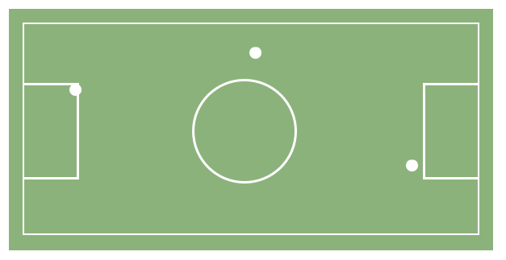

# **La cancha**

### **Objetivo:**

- Crear una cancha de fútbol y modificar el flujo de los elementos haciendo uso de _positioning._

### **Resumen**
Cada parte de la cancha fue nombrada de la forma que se muestra más abajo, y a cada una de ellas se le aplicó la propiedad _position_.
1. **Field:** Representa la totalidad del campo.

   - _Valor aplicado:_ relative.

- **Footballbow:** Representa los 2 arcos.

  - _Valor aplicado:_ absolute.

- **Circle:** Representa el mediocampo.

  - _Valor aplicado:_ absolute.

- **Ball:** Representa las 3 pelotitas.

  - _Valor aplicado:_ absolute.

El resultado final será:

